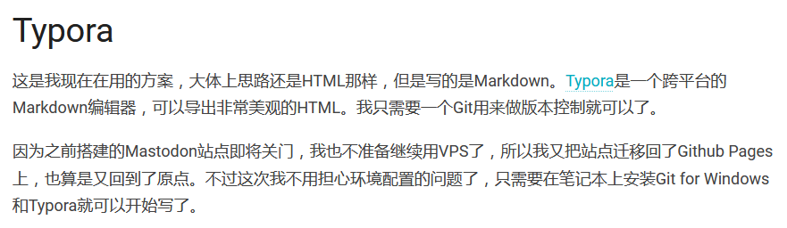
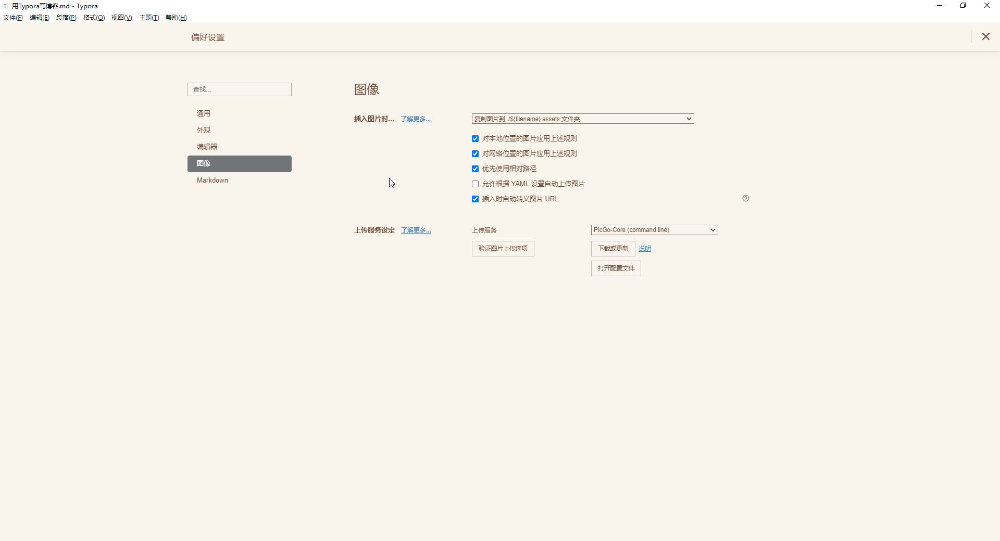

因为整个repo放在Github上，所以本地可以用Typora来撰写文章，图片也不需要其他图床



以上截图来自[奈卜拉的小站](https://i.nebula.moe)的[我是怎么写博客的](https://i.nebula.moe/posts/2020-09-07-blog/)

找到这个解决方案也是受以上文章影响，

调整一下【偏好设置】里的插入图片时操作



然后在解析的时候把相对路径调整成绝对路径就能看到图片了

``` js
$(".thread img").each((index,el)=>{
          const $el = $(el);
          const src = $el.attr('src');
          if(!src.startsWith('http')) {
            $el.attr('src','https://raw.githubusercontent.com/${github_base}/master/posts/' + src);
          }
        });
```
这个样子也不一定要是github的吧，只要能以镜头资源形式获取到站点都可以